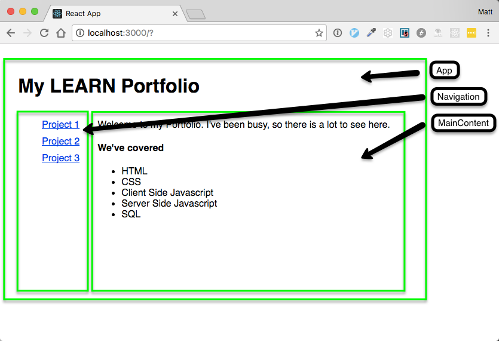
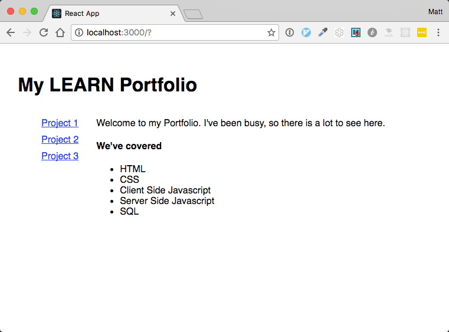
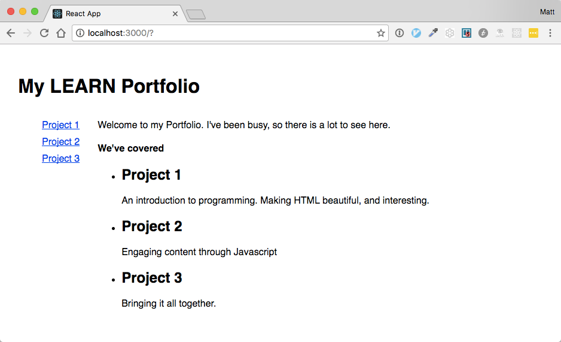

# Components and Props

Up until now, we've been focused on internal state of our components.  In
the Portfolio example, we created an App, Navigation and MainContent
component, and defined the state for each of them.  



State is not shared between components.  Navigation does not have access
to the internal state of MainContent.  Navigation and MainContent don't
even have access to their parent component App (there are ways to do this,
but it should be avoided at all cost).  Maintaining isolated state like
this is a good thing.  If components were aware of each other's' internal
state and made use of it, they would be dependent on each other.  This is
often referred to as 'tight coupling' and is not a good thing because it
leads to bugs that are hard to diagnose.  By taking advantage of Reactjs'
built in state isolation, our components are loosely coupled, and we avoid
entire categories of bugs.

## Passing in Props

So how then do we have two or more components that make use of the same
data?  Imagine, for example, that we want the Navigation component to link
to anchor tags within the MainContent component.  We can achieve this by
moving state completely out of both components, and passing it back in
through the use of props.  Lets look at the Navigation component for an
example.

Recall that the Navigation component currently maintains a list of links
in its internal state:

```javascript

import React, { Component } from 'react'

import './Navigation.css'

class Navigation extends Component {
  constructor(props){
    super(props)
    this.state = {
      links: [
        {
          name: 'Project 1',
          path: '#'
        },
        {
          name: 'Project 2',
          path: '#'
        },
        {
          name: 'Project 3',
          path: '#'
        }
      ]
    }
  }

  render() {
    return (
      <div className='navigation'>
        <ul>
          {this.state.links.map((link)=> {
            return(
              <li key={link.name}>
                <a href="{link.path}">{link.name}</a>
              </li>
            )
          })}
        </ul>
      </div>
    )
  }
}

export default Navigation;
```

We start by moving the list of links from Navigation up to its parent App.
Notice that we rename the attribute names to something a bit more general
purpose.

```javascript
// App.js

...
class App extends Component {
  constructor(props){
    super(props)
    this.state = {
      projects: [
        {
          name: 'Project 1',
          description: "An introduction to programming.  Making HTML beautiful, and interesting.",
          anchor: '#'
        },
        {
          name: 'Project 2',
          description: "Engaging content through Javascript",
          anchor: '#'
        },
        {
          name: 'Project 3',
          description: "Bringing it all together.",
          anchor: '#'
        }
      ]
    }
  }
  ...
```

Then, in the `render()` function, we pass them back down to Navigation

```javascript
...
 render() {
    return (
      <div className='app-container'>
        <div className='app-header'>
          <Header></Header>
        </div>
        <div className='app-main-content'>
          <div className='app-navigation'>

            // links is a property ('prop') on Navigation
            <Navigation links={this.state.projects}></Navigation>

          </div>
          <div className='app-projects'>
            <MainContent></MainContent>
          </div>
        </div>
      </div>
    );
  }
...
```

Now, in the Navigation component, we update it to use the property, instead of internal state

```javascript
import React, { Component } from 'react'

import './Navigation.css'

class Navigation extends Component {
  render() {
    return (
      <div className='navigation'>
        <ul>
          {this.props.links.map((link)=> {
            return(
              <li key={link.name}>
                <a href="{link.anchor}">{link.name}</a>
              </li>
            )
          })}
        </ul>
      </div>
    )
  }
}

export default Navigation;
```

When the page reloads, it looks the same as before



Now we're all setup to use the projects in the MainContainer component as
well.  We'll replace its old content with what gets passed in through
props.

Pass the projects to MainContainer in App.js

```javascript
...
  render() {
    return (
      <div className='app-container'>
        <div className='app-header'>
          <Header></Header>
        </div>
        <div className='app-main-content'>
          <div className='app-navigation'>
            <Navigation links={this.state.projects}></Navigation>
          </div>
          <div className='app-projects'>

            // Adds projects to props of MainContent
            <MainContent projects={this.state.projects}></MainContent>

          </div>
        </div>
      </div>
    );
  }
...
```

And update MainContent to make use of projects prop

```javascript

import React, { Component } from 'react';

class MainContent extends Component {
  render() {
    return (
      <div className='main-content'>
        <p>Welcome to my Portfolio.  I've been busy, so there is a lot to see here.</p>
        <h4>We've covered</h4>
        <ul>
          {this.props.projects.map((project)=>{
            return (
              <li key={project.name}>
                <h2>{project.name}</h2>
                <p>{project.description}</p>
              </li>
            )
          })}
        </ul>
      </div>
    );
  }
}

export default MainContent;

```

When the page reloads, we see that projects is now shared between all
3 components, and we've kept things nice and dry by moving our 'single
  source of truth' up to be the App component's state





## Difference between Props and State

## Pure vs. Impure components

## Container Pattern

6. A closer look at components
  - Instructor led
  - refactor Tic-Tac-Toe to make better use of components
  - state
  - props
  - component life cycle
    - constructor
    - defined
    - mounted
    - rendered
    - destroyed

- Pure vs. Impure Components
  - pure
    - building a stateless component
    - no side effects
    - given the same inputs, it will always render exactly the same thing


4. Tic-Tac-Toe in pure Javascript
  - Instructor led
  - point out managing state in dom
  - refactor to pull state out of dom
  - introduce a render function


5. Tic-Tac-Toe using React
  - Assignment format, follow instructions


