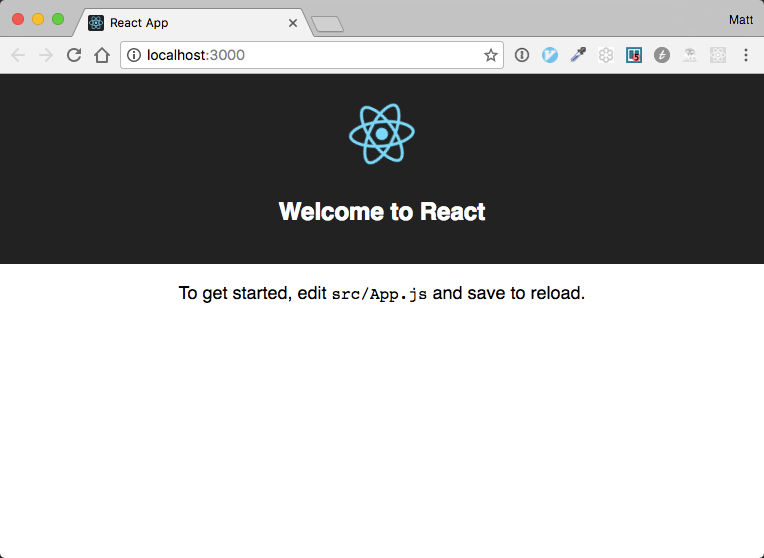

# ReactJS

## What is Reactjs?

React is a Javascript library for building user interfaces.  We can use it to
build webpages, mobile web pages, and even native mobile applications.  It is
component based, which means that we use it to build many small parts, and then
join them together to form entire applications.  This turns out to be extremely
scalable.  We'll be starting out small, but React is used to build the world's
largest websites.  It was created from Facebook as that application grew and
became more dynamic.  Let's dive in!

## Hello World

We'll start with an app that is composed of just a single component, and from
there build out more useful and engaging features for our users.  Up until late
2016, the hardest part about working with React was just getting a new app
setup, so you could begin working on it.  Facebook recognized this problem, and
released some tools to help developers get started easily.  We'll be looking at
some of the important things the following command does for us, but for now,
lets use it to quickly setup an app for us, and get building.

Use NPM to install the create-react-app, so we can build our first React app.
```
$ npm install -g create-react-app
$ create-react-app hello-world
```

This creats a directory called 'hello-world' in the current directory and
installs all the files we'll need to get started.  Change into the new
directory, and fire up your new app.

```
$ cd hello-world
$ npm start
```

Check your browser.  You've created your first ReactJS app!  


There are some instructions there to help us get started.  Let's open 'src/App.js' and see what it contains.  Go ahead and leave the server that we started with `npm start` running, and open a new terminal window.  Every time we save our work, the server will notice the changes, and reload the page.  Pretty neat!

```
$ atom src/App.js
```
```javascript
// We're using React and Component from the react library
import React, { Component } from 'react';

// We're using webpack to load assets in our project, so loading images
// works much like CSS. We can import them much like any other file.
import logo from './logo.svg';

// The main css file this app uses
import './App.css';

// We create a new component that extends the Component class, which React provides
class App extends Component {

  // When the component is first put on the page, and every time something changes in our component, the render function is called.  This function builds the html markup that will be put on the page by React.
  render() {

    // Here we have HTML markup right in our .js file.  Most of the React
    // apps that you see, and all of the ones that we'll build in class
    // use something called JSX to preprocess HTML (XML actually) back
    // into plain old JavaScript before the file is sent to the browser.
    // Its not absolutly necessary to use JSX with React, but it makes it
    // so much easier to write React components.
    return (
      <div className="App">
        // Why 'className' instead of 'class'?  It was a design decision on the
        // part of the React development team.  There is lots of great
        // discussion about this on the web around this if you are interested.
        // The important thing to recognize here is that everything is
        // a component in React, so what is really happening here is the div
        // component recieves an attribute named 'className', and is able to
        // operate on it as it is being rendered to the screen.
        <div className="App-header">

          // Notice the '{logo}'.  Everything inside the '{}' when using
          // JSX is evaluated as plain JavaScript.  This line just access
          // the content of the variable 'logo' in our component which we
          // imported above.
          
          <h2>Welcome to React</h2>
        </div>
        <p className="App-intro">
          To get started, edit <code>src/App.js</code> and save to reload.
        </p>
      </div>
    );
  }
}

export default App;
```

Edit this file to make it our own, and save it.  The browser will reload
showing our changes. We'll remove all of the boilerplate that we got for
free when we ran 'create-react-app'

```javascript

import React, { Component } from 'react';

class App extends Component {
  render() {
    return (
      <div>
        <h1>Hello World!</h1>
      </div>
    );
  }
}

export default App;
```

Save, and check the browser.  The app is now a lot more plain looking compared
to what create-react-app gave us, but this is a big step forward. We're now
building out our own component.  We'll be adding all kinds of interesing things
to our app soon enough.


