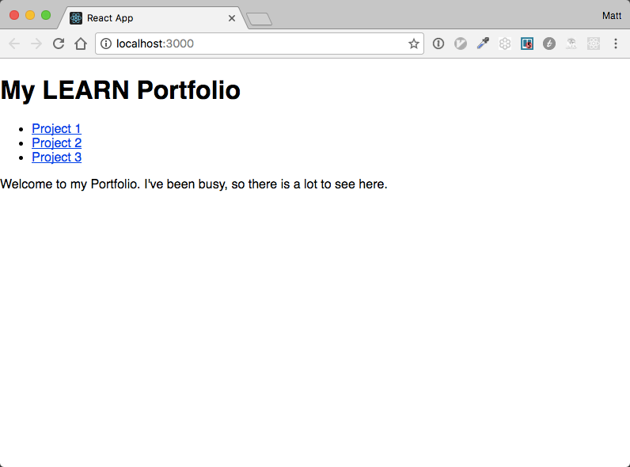

## Adding in CSS 

Its time to add some style to our page.  Remember the App.css
file we got from create-react-app?  Its still there, so we can start to modify
it to suit our needs.  We're going to use the flexbox model to make our app
look great on desktop, and mobile.

```css
.app-container{
  display: flex;
  flex-direction: column;

  margin: 30px;
}

.app-main-content{
  display: flex;
}

.app-projects{
  margin: 0 30px;
}

/* Small screens */
@media all and (max-width: 500px) {
  .app-main-content{
    flex-direction: column;
  }
}
```

We need to add the classNames to the App.js template too

```javascript
...
  render() {
    return (
      <div className='app-container'>
        <div className='app-header'>
          <Header></Header>
        </div>
        <div className='app-main-content'>
          <div className='app-navigation'>
            <Navigation></Navigation>
          </div>
          <div className='app-projects'>
            <MainContent></MainContent>
          </div>
        </div>
      </div>
    );

...
```



This gives us a decent looking page that is well organized.  Those are still
a little plain however.  We don't need the bullet next to each one at least. We
can include stylesheets into our sub-components as well, and keep a separate css file just for the navigation.

```css
.navigation ul{
  list-style-type: none;
}

.navigation ul li{
  margin-bottom: 10px;
}
```

