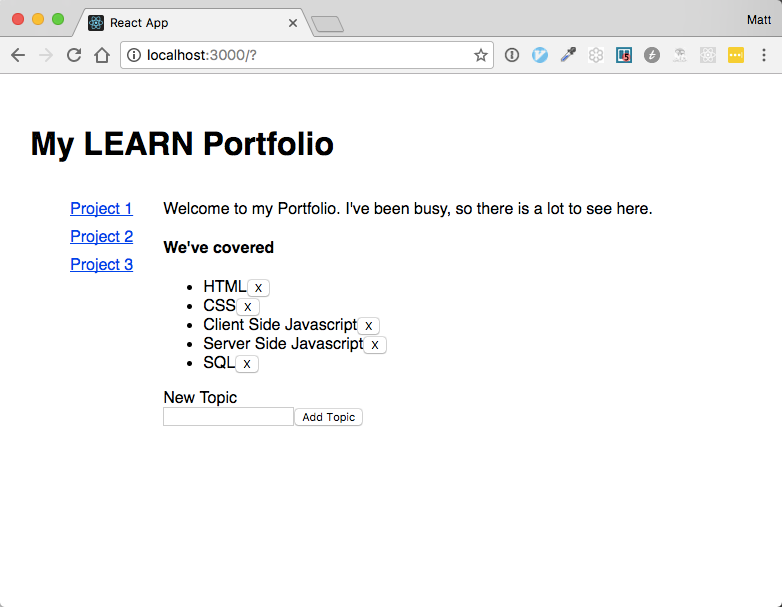

### Forms

Next we'll add the ability for the user to add new topics to the list using a form with one input, and a submit button.  HTML form elements work somewhat differently in React than other DOM elements because the form itself maintains some internal state.  Input elements retain the current state of user interaction.  We want React to be the "single source of truth", and be the only place where state is maintained.  To achieve this, we use a technique called "controlled components" in the React documentation.

The Value of the `<input>`, `<select>`, and `<textarea>` elements in an HTML form typically maintain their own state, and update based on user input.  We want our component state to be in control, and as we have already seen, the only way to update its state is to call `this.setState()`.  

To get started, lets add the 'source of truth' for our topic input element to the components state:

```javascript
  constructor(props){
    super(props)

    this.state = {
      
      // adding the current value of the form input to the component state
      topicInput: '',

      topics: [
        {
          name: "HTML"
        },
        {
          name: "CSS"
        },
        {
          name: "Client Side Javascript"
        },
        {
          name: "Server Side Javascript"
        },
        {
          name: "SQL"
        },
      ]
    }
  }
  ...
```

Next, we need to update the component state when the input is changed by the user, so we add a function to update it:

```javascript
  handleTopicInputChange(event){
    this.setState({topicInput: event.target.value})
  }
```

And when the user clicks 'Add Topic', we need to handle that too:

```javascript
  topicFormSubmit(event){
    const newTopics = this.state.topics.concat({name: this.state.topicInput})
    this.setState({topics: newTopics})
    this.setState({topicInput: ''})
    event.preventDefault()
  }
```
In this function, we create a new list of topics with the new topic added to it, and update the component state.  Then we clear the form input, so the user can add another topic if they choose. 

The default behavior for a form is designed to handle input that is submitted to a backend server, and then the browser is reloaded with the results of any server side processing that happens.  In our case, we've done all we need to do right here in the component, so we cancel the default behavior by calling `event.preventDefault()` function, we create a new list of topics with the new topic added to it, and update the component state.  Then we clear the form input, so the user can add another topic if they choose. 

The default behavior for a form is designed to handle input that is submitted to a backend server, and then the browser is reloaded with the results of any server side processing that happens.  In our case, we've done all we need to do right here in the component, so we cancel the default behavior by calling `event.preventDefault()`.

Now we're all set with our form handler functions, so lets look at the form in our render function:

```javascript
  render() {
    return (
      <div className='main-content'>
        <p>Welcome to my Portfolio.  I've been busy, so there is a lot to see here.</p>
        <h4>We've covered</h4>
        <ul>
          {this.state.topics.map((topic, index)=>{
            return (
              <li key={topic.name}>
                {topic.name}
                <button
                  onClick={(event) => this.removeTopicClick(event)} 
                  data-index={index}
                >X</button>
              </li>
            )
          })}
        </ul>

        // We use the onSubmit event to do our own form processing, instead of default behavior
        <form onSubmit={this.topicFormSubmit.bind(this)}>

          <form-control>
            <label>New Topic</label>
            <br />

            // This is a 'controlled component', so React has 
            // control of both the value, and events when the input value changes
            <input id='topic-input' value={this.state.topicInput} onChange={this.handleTopicInputChange.bind(this)} />

          </form-control>
          <input type='submit' value='Add Topic' />
        </form>

      </div>
    );
  }
```

Are you wondering about the `.bind(this)` on the `form` and `input` dom elements?  `bind()` is a method that we can call on functions to change the internal value of `this` in that function.  Recall that HTML elements in React are really components themselves, so they maintain their own state.  When we pass a function in to be evaluated `onSubmit`, its default behavior would be to be evaluated within the context of the `form` component, which isn't what we want.  We want the context to be our `MainComponent` component, which we achieve by calling `.bind(this)` on the method passed in.

Our topic list is now complete.  We can add and remove as many topics as we like.  We've learned how to manage state within a component, and how to have full control over form elements.  Here is the complete MainContent.js component:



```javascript

import React, { Component } from 'react';

class MainContent extends Component {
  constructor(props){
    super(props)
    this.state = {

      // adding the current value of the form input to state
      topicInput: '',

      topics: [
        {
          name: "HTML"
        },
        {
          name: "CSS"
        },
        {
          name: "Client Side Javascript"
        },
        {
          name: "Server Side Javascript"
        },
        {
          name: "SQL"
        },

      ]
    }
  }

  handleTopicInputChange(event){
    this.setState({topicInput: event.target.value})
  }

  topicFormSubmit(event){
    const newTopics = this.state.topics.concat({name: this.state.topicInput})
    this.setState({topics: newTopics})
    this.setState({topicInput: ''})
    event.preventDefault()
  }

  removeTopicClick(event){
    const indexToRemove = event.target.dataset.index
    const topics = this.state.topics.slice(0)
    topics.splice(indexToRemove, 1)
    this.setState({topics: topics})
  }

  render() {
    return (
      <div className='main-content'>
        <p>Welcome to my Portfolio.  I've been busy, so there is a lot to see here.</p>
        <h4>We've covered</h4>
        <ul>
          {this.state.topics.map((topic, index)=>{
            return (
              <li key={topic.name}>
                {topic.name}
                <button
                  onClick={(event) => this.removeTopicClick(event)} 
                  data-index={index}
                >X</button>
              </li>
            )
          })}
        </ul>

        <form onSubmit={this.topicFormSubmit.bind(this)}>
          <form-control>
            <label>New Topic</label>
            <br />
            <input id='topic-input' 
              value={this.state.topicInput} 
              onChange={this.handleTopicInputChange.bind(this)} />
          </form-control>
          <input type='submit' value='Add Topic' />
        </form>

      </div>
    );
  }
}

export default MainContent;

```


